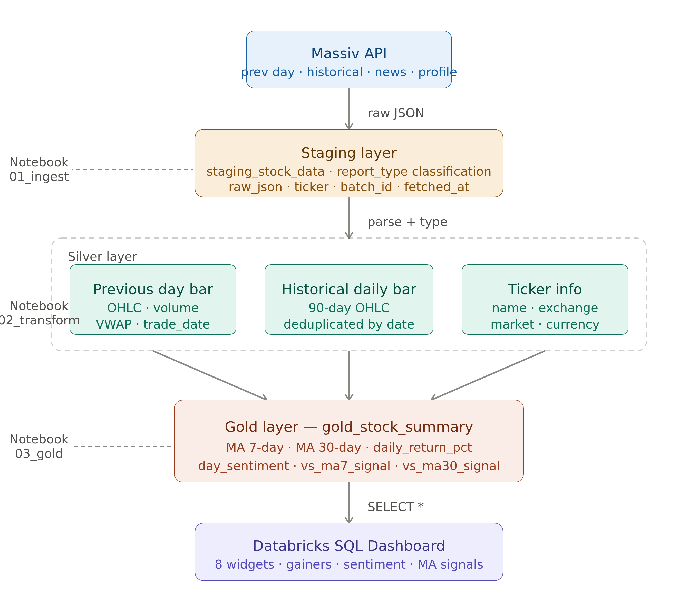
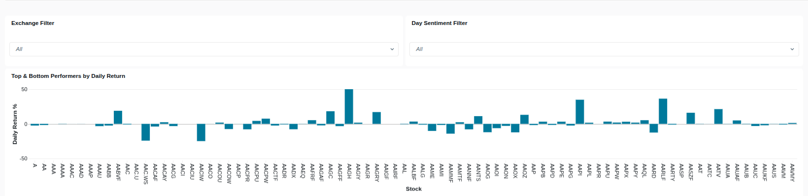
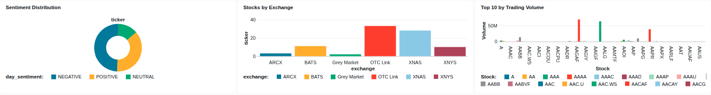
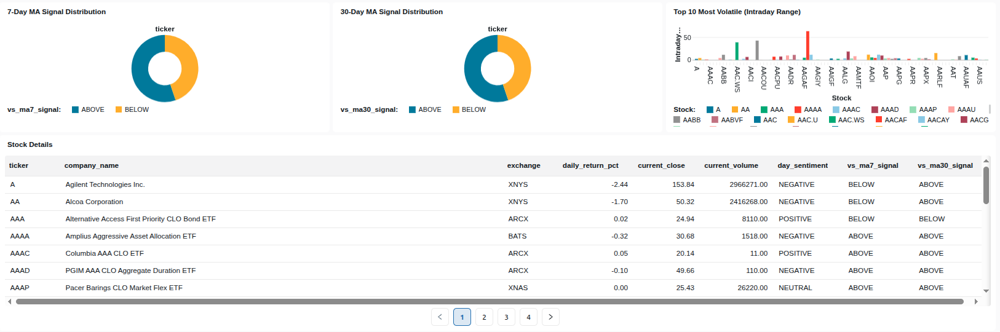

# StockPulse: Stock Market Analytics Pipeline on Databricks

A production-style batch data engineering pipeline that ingests 
US stock market data for 500+ tickers, processes it through a 
medallion architecture, and serves insights via an interactive dashboard.

---

## Architecture

Massiv API → Staging (Raw JSON) → Silver (Parsed) → Gold (Aggregated) → Databricks SQL Dashboard

---

## Tech Stack

| Layer | Technology |
|---|---|
| Platform | Databricks Community Edition |
| Processing | Apache Spark (PySpark) |
| Storage | Delta Lake |
| Data Source | Massiv Financial API (formerly Polygon.io) |
| Dashboard | Databricks SQL Dashboard |
| Language | Python |

---

## Pipeline Layers

### Staging Layer — staging_stock_data
Raw API responses stored as JSON strings with report_type 
classification. One row per ticker per API call. Preserves 
original data for reprocessability.

Report types: DAILY_OHLC, HISTORICAL, TICKER_INFO

### Silver Layer — 3 Tables
- silver_previous_day_bar — parsed daily OHLC with price, 
  volume, VWAP, transaction count
- silver_historical_daily_bar — 90-day historical OHLC 
  per ticker, deduplicated on ticker + trade_date
- silver_ticker_info — company reference data including 
  name, exchange, market, currency

### Gold Layer — gold_stock_summary
Business-ready aggregation table. One row per ticker containing:
- Current price and daily return percentage
- 7-day and 30-day moving averages (computed via Spark window functions)
- Trend signals — ABOVE or BELOW each moving average
- Day sentiment — POSITIVE, NEGATIVE, NEUTRAL
- Intraday volatility range percentage

---

## Dashboard

Interactive Databricks SQL Dashboard with 8 widgets:

- Top and Bottom Performers by Daily Return
- Sentiment Distribution across all tickers
- Stocks by Exchange breakdown
- Top 10 by Trading Volume
- 7-Day MA Signal Distribution
- 30-Day MA Signal Distribution
- Top 10 Most Volatile stocks by intraday range
- Full Stock Details table

---

## Key Technical Decisions

**Why staging with report_type instead of separate raw tables**
Mirrors enterprise ETL patterns where all raw data flows 
into one landing zone with type classification. Simplifies 
ingestion logic and enables unified audit trail.

**Why compute moving averages in Spark instead of fetching from API**
Demonstrates Spark window function proficiency. 
Window.partitionBy(ticker).orderBy(trade_date).rowsBetween(-6, 0) 
computes rolling 7-day average without loading all data into memory.

**Why left join in Gold layer**
Prevents silent data loss if a ticker is missing from one 
silver table due to an API failure. All tickers from the 
primary table are preserved in the output.

---

## How to Run

1. Set up Databricks Community Edition account
2. Get free API key from massive.com
3. Import notebooks from notebooks/ folder into Databricks
4. Run in order: 01 → 02 → 03
5. Create SQL Dashboard using queries in dashboard/ folder

---

## What I Would Add Next

- Airflow or Databricks Jobs for automated scheduling
- News ingestion pipeline with NLP sentiment analysis
- Data quality checks between Silver and Gold layers
- Iceberg table format for historical data with time travel
- AWS deployment — S3 + Glue + Athena replacing DBFS + Delta
